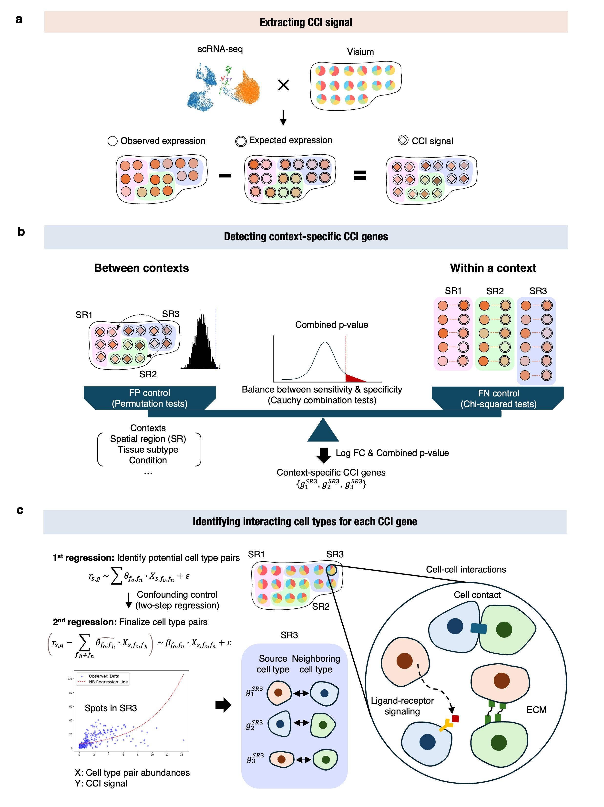

[](https://pypi.org/project/CellNeighborEX)


CellNeighborEX v2: Identifying Context-Specific Cell-Cell Interaction Genes Without Ligand-Receptor Databases from Spatial Transcriptomics
====================================================================================
<p align="justify">CellNeighborEX v2 is a database-free computational framework for identifying cell–cell interaction (CCI)–associated genes from spatial transcriptomics (ST) data. Most existing CCI inference approaches rely on predefined ligand–receptor databases, which limits their ability to capture diverse interaction mechanisms, particularly in low-resolution ST platforms such as Visium.

CellNeighborEX v2 addresses this limitation by detecting deviations between observed and expected gene expression at the spot-population level, enabling direct identification of genes influenced by neighboring cell types. These deviations are evaluated using a hybrid statistical framework based on permutation testing and cell-type pair abundance.

Unlike conventional ligand–receptor–based methods, CellNeighborEX v2 can capture a broad spectrum of intercellular communication mechanisms, including both paracrine signaling and contact-dependent interactions.

Across multiple datasets—including hippocampus, liver cancer, colorectal cancer, ovarian cancer, and lymph node infection—CellNeighborEX v2 accurately recapitulates previously reported CCIs and reveals additional context-specific interactions not represented in existing databases.

By expanding the analytical potential of low-resolution ST data, CellNeighborEX v2 provides a powerful tool for exploring the molecular language of intercellular communication in complex tissues.
</p> 

## Workflow

The figure below shows the workflow of CellNeighborEX v2:



## Installation
<p align="justify">CellNeighborEX v2 requires Python version >= 3.9 and < 3.11. We recommend using conda environment to avoid dependency conflicts. The dependencies are listed in requirements.txt.</p> 

```bash
# Create conda environment “CellNeighborEX-env”
conda create -n CellNeighborEX-env python=3.9
conda activate CellNeighborEX-env

# Navigate into the directory where requirements.txt is located. Then, install dependencies
pip install -r requirements.txt

# Install CellNeighborEX v2 from PyPI
pip install CellNeighborEX
```

## Usage

Example pipeline scripts are provided in the `execution_scripts/` directory.

To run the full CellNeighborEX v2 pipeline:

```bash
bash execution_scripts/run_cnex2.sh
```

Key configuration options include:
```
START_FROM=1  → run full pipeline (ccisignal → ccigenes → ccipairs)

START_FROM=6  → resume from precomputed ccisignal outputs
```

## Dataset-Specific Settings

When running the pipeline for a specific dataset, configure
`CLUSTER_INFO` and `SPECIES` in `run_cnex2.sh`.

| Dataset | CLUSTER_INFO | SPECIES |
|--------|--------------|--------|
| simulation | spatial_kmeans | human |
| hippocampus | proportion_leiden | mouse |
| liver cancer | proportion_leiden | mouse |
| ovarian cancer | cluster | human |
| colorectal cancer | proportion_leiden1 | human |
| lymph node | sample_keys | mouse |

### Lymph node dataset

For the lymph node dataset (PBS and MS conditions), use the dedicated scripts:

execution_scripts/main_lymph.py  
execution_scripts/run_cnex2_lymph.sh

## Outputs

The pipeline generates the following outputs:

| File | Description |
|-----|-------------|
| `sc_ccisignal.h5ad` | cell-type–specific reference signatures |
| `sp_ccisignal.h5ad` | Visium data with expected expression values |
| `ccigenes_results.csv` | inferred CCI genes |
| `ccipairs_results.csv` | interacting cell-type pairs |

## Data Availability

The datasets used in the CellNeighborEX v2 manuscript, including the precomputed outputs of the `ccisignal` module, are available on figshare:

https://doi.org/10.6084/m9.figshare.30259902

These files enable reproducibility of the downstream analyses described in the manuscript.

## Citation
Hyobin Kim, Beomsu Park, Junghyun Jung, Seulgi Lee, Sanaz Panahandeh, Soyoung Kwon, Jingyi Jessica Li, Dongha Kim, Junil Kim, Kyoung Jae Won, Identifying Context-Specific Cell-Cell Interaction Genes Without Ligand-Receptor Databases from Spatial Transcriptomics.

## License
MIT License

## Patent
Certain methods implemented in CellNeighborEX are subject to patent protection.  
A US provisional patent application has been filed.